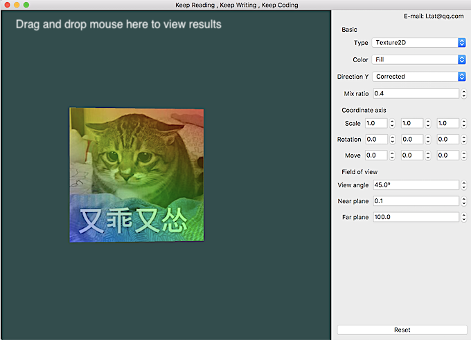

<h1 align="center">GMath</h1>

<p align="center">
    
    <a href="https://github.com/CatOnly/GMath/blob/master/LICENSE">
    	
    </a>
</p>

OpenGL Mathematics (GMath) is a header only C++ mathematics library for graphics software based on the [OpenGL Shading Language (GLSL) specifications](https://www.opengl.org/registry/doc/GLSLangSpec.4.50.diff.pdf).


## Introduction

*GMath* provides classes and functions designed and implemented with the same naming conventions and functionality than *GLSL* so that anyone who knows *GLSL*, can use *GMath* as well in C++.

The point of *GMath*'s work is making it's basic data type(vector, matrix and quaternion) more purely for storage.

Several characteristics of GMath must be known before starting：

- Default *right-hand coordinate system*.

- Matrix uses *column priority* to store data.

- In order to keep *GMath* lightweight, it only keeps the common functions in *GLSL*.

- Use template class, you can set the precision of data you want.


Todo list:

- Support the left-hand coordinate system.
- Optimize code structure.
- ...


## Getting Started

1. Copy all the files in the *src* folder into your project. 

2. By inlcude *GMath.hpp* files, you can use all the functions of *GMath*

3. Here is the sample code

   ```c++
   #include "GMath.hpp"
   
   void main(){
       gm::vec3 axisX(2, 0, 0);
       gm::vec3 axisY(0, 1, 2);
       gm::vec3 axisZ(1, 0, 0.5);
       gm::mat3 unitM3;
       gm::mat3 coordinateM3(
           axisX * 0.5,
           3.0f * axisY,
           -axisZ
       );
       
       unitM3 *= 2;
       
       std::cout << "Vector3:" << std::endl << axisY
           	  << "Matrix3X3:" << std::endl << unitM3 * coordinateM3 << std::endl;
   }
   ```


## Some functions you may need to know

Like *GLSL*:

-  `vec3.x, vec3.r, vec3.s` is the same data in memory.

- number * vector = vector * number = number multiplied by every element(x, y, z) in the vector.

- number * matrix = matrix * number = number multiplied by every element in the matrix.

- vector * vector = The product of each corresponding element of them.

  Using function `gm::dot` or `gm::cross` compute by geometric method.


## Example project

[Here](example/GMathDemo.pro) is a QT project, only test on macOS, OS X.

To know how to use *GMath* in the project. Look at [SFLCameraVirtual.h](example/SFLCameraVirtual.h) and [SFLModelNoLight.h](example/SFLModelNoLight.h)

